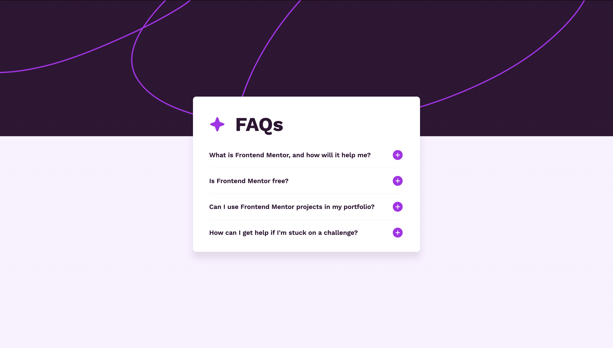

# Frontend Mentor - FAQ accordion solution

This is a solution to the [FAQ accordion challenge on Frontend Mentor](https://www.frontendmentor.io/challenges/faq-accordion-wyfFdeBwBz). Frontend Mentor challenges help you improve your coding skills by building realistic projects. 

## Table of contents

- [Overview](#overview)
  - [The challenge](#the-challenge)
  - [Screenshot](#screenshot)
  - [Links](#links)
- [My process](#my-process)
  - [Built with](#built-with)
  - [What I learned](#what-i-learned)
  - [Continued development](#continued-development)
  - [Useful resources](#useful-resources)
- [Author](#author)


## Overview

### The challenge

Users should be able to:

- Hide/Show the answer to a question when the question is clicked
- Navigate the questions and hide/show answers using keyboard navigation alone
- View the optimal layout for the interface depending on their device's screen size
- See hover and focus states for all interactive elements on the page

### Screenshot



### Links

- Solution URL: [My solution repo](https://github.com/nicholasboyce/faq-accordion)
- Live Site URL: [Preview URL here](https://nicholasboyce.github.io/faq-accordion)

## My process

I went over the design images and created small sections in order to understand how to break up each component. I then set the standard CSS "resets" and also tried to define CSS variables/custom properties to reduce overall repetitive code.

### Built with

- Semantic HTML5 markup
- CSS custom properties
- Flexbox
- CSS Grid

### What I learned

I practiced using custom properties in a way that allows for something like "private" properties. By default each item is not active, and so the variables would not be defined, and only use their defaults of none and block for displaying their respective buttons. When active, we can define the variables and swap them, which is a really clean and satisfying way of minimizing Javascript as well!

```css
.accordion-item {
    --_minus: var(--minus, none);
    --_plus: var(--plus, block);
    display: grid;
    grid-template-rows: auto 0fr;
    transition: grid-template-rows 500ms;
    padding: 1rem 0;
}

.accordion-item.active {
    grid-template-rows: auto 1fr;
    gap: 1rem;
    --minus: block;
    --plus: none;
}

.plus {
    display: var(--_plus);
    --fill-color: var(--clr-accent);
}

.minus {
    display: var(--_minus);
    --fill-color: var(--clr-primary);
}
```

### Continued development

I'd really like to focus a bit more on using custom properties for unified color palettes and an overall cohesive and easy to manage look.

### Useful resources

- [Making a simple accordion](https://www.youtube.com/watch?v=B_n4YONte5A) - This helped me for XYZ reason. I really liked this pattern and will use it going forward.
- [Taking advantage of custom properties](https://www.youtube.com/watch?v=5QIiWIoCmsc) - This is an amazing video which really made me understand the true utility of custom properties.

## Author

- Frontend Mentor - [@nicholasboyce](https://www.frontendmentor.io/profile/nicholasboyce)

